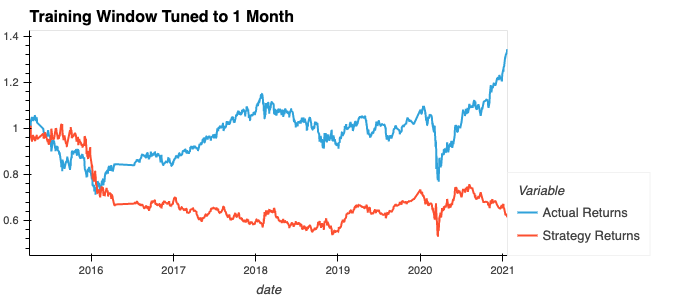
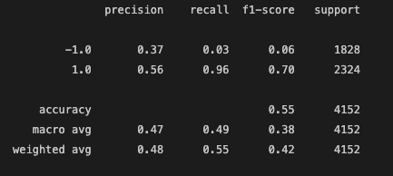

# Machine Learning Trading Bot

## Description

In this challenge, I've assumed the role of a financial advisor at financial advisory firm. We compete with other major firms to manage and automatically trade assets in a highly dynamic environment. Here, I am improving the existing algorithmic trading system to maintain competitive advantage in the market. I do this by enhancing the existing trading signals with machine learning algorithms that adapt to new data.

### Libraries

Libraries used are pandas, numpy, hvplot, matplotlib and sklearn

# Summary

## Baseline

The baseline performance is set with a training window of 3 months.

## Adjusted Training Window

As shown below, increasing or decreasing the training window results in negligible improvements.

