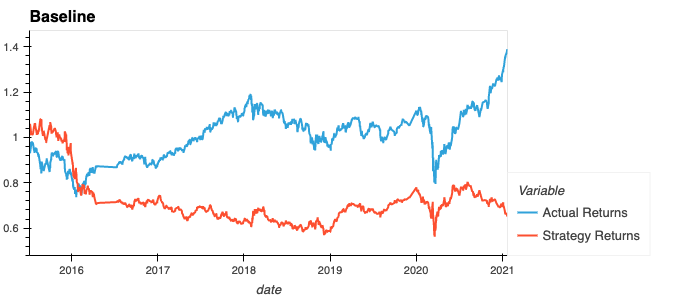
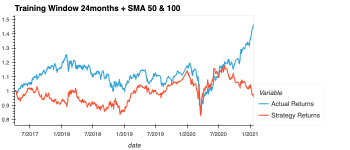
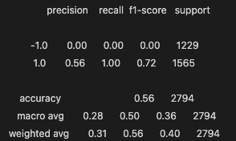
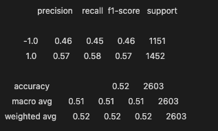
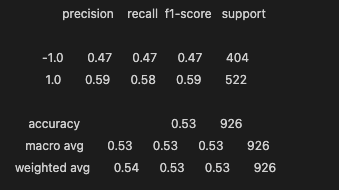

# Machine Learning Trading Bot

## Description

In this challenge, I've assumed the role of a financial advisor at financial advisory firm. We compete with other major firms to manage and automatically trade assets in a highly dynamic environment. Here, I am improving the existing algorithmic trading system to maintain competitive advantage in the market. I do this by enhancing the existing trading signals with machine learning algorithms that adapt to new data.

### Libraries

Libraries used are pandas, numpy, hvplot, matplotlib and sklearn

# Summary Analysis

Please refer to the charts and classification reports below for different tunings and models explored building this machine learning trading bot.

## Tuning from Baseline SVM Model
The greatest impact to improving the baseline model is in tuning the training window. The short and long SMA window did not have much impact when tuned while maintaining the baseline training window at 3months. When tuning the training window, I made the adjustment from baseline of 3months to 12, 24, 36 and 48months. When tuned to 36months, the overall strategy performs the greatest when compared to the other training window models. 

Adjusting the SMA short and long windows alone, did not yield much impact when the baseline training window is maintained at 3months.

When tuning the parameters for both training and SMA windows, it was settled that the best performing SVM model is tuned to 36months with SMA windows set at 50 and 200.

## Exploring Additional Machine Learning Models
By optimizing the model further a variety of models were explored including, Logistic Regression, AdaBoost, Gradient Boosting Classifier, Decision Tree Classifier and Random Forest. Of the group classifiers, Random Forest is the best performing strategy as evidenced when compared to the other models.

---
## Baseline - SVM Model - 3-month Training Window + SMA Windows of 4 and 100 days

### Baseline - Classification Report

## Adjusted Training Window - SMA Baseline Maintained at 4 and 100 days

## Adjusted Simple Moving Average (SMA) - Baseline Training Window Maintained at 3-months

## Adjust Training Window and SMAs

# Exploring Additional Machine Learning Models

